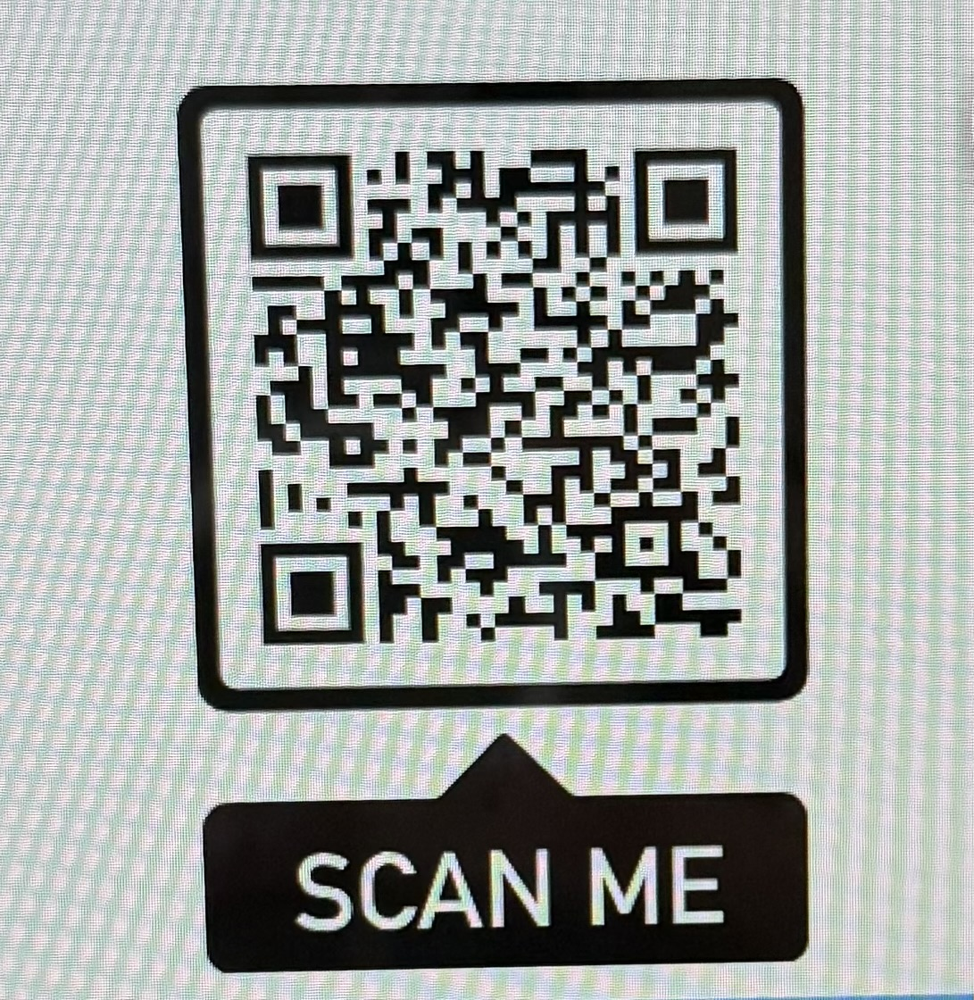

# 🍽️ DineSight – Restaurant Review Analysis using NLP  

## 📌 Project Overview  
**DineSight** is an intelligent restaurant review system designed to bridge the gap between **customer satisfaction** and **restaurant owners’ decision-making**. It provides **real-time feedback** from customer reviews, helping food startups and restaurant chains analyze customer preferences, likes, and dislikes based on their comments.  

The system enables customers to submit reviews easily, while owners can securely access a dashboard to monitor feedback and take data-driven actions.  

---

## 🚀 Key Features  
- ✅ **Customer Review System** – Users can submit reviews about food items they tried.  
- ✅ **Real-time Dashboard** – Owners can track likes, dislikes, and satisfaction trends.  
- ✅ **ML-based Sentiment Analysis** – Progressive use of **Naive Bayes, SVM, and Random Forest** to improve model accuracy.  
- ✅ **Secure Owner Access** – Passcode-protected dashboard accessible only by restaurant owners.  
- ✅ **QR Code Feature** – Customers can scan a QR code to directly access the review portal.  
- ✅ **Fully Deployed** – Live deployment using **Streamlit Cloud** for seamless usage.  

---

## 🧠 Tech Stack  
- **Programming Language**: Python  
- **Frameworks**: Streamlit, Scikit-learn, NLTK  
- **Machine Learning Models**: Naive Bayes, SVM, Random Forest  
- **Database**: SQLite (for storing reviews and feedback)  
- **Deployment**: Streamlit Cloud with QR code integration  

---

## 📊 Problem Solved  
- Food startups often lack structured feedback channels to understand customer satisfaction.  
- DineSight provides a **data-driven solution** where customer reviews are transformed into actionable insights.  
- Owners can refine **menu options, food quality, and service** based on live customer sentiment.  

---

## 🔑 How It Works  
1. Customers scan a **QR code** to open the review page.  
2. They submit their feedback in text form.  
3. The system applies **NLP-based sentiment analysis** (positive/negative/neutral).  
4. Results are stored in the database and displayed on the owner’s dashboard.  
5. Owners log in with a **secure passcode** to view customer sentiment insights.  

---

## 📌 Future Enhancements  
- 📈 Integration with **deep learning models (LSTMs, Transformers)** for improved sentiment accuracy.  
- 🌎 Multi-language support for diverse customers.  
- 📱 Mobile app version for wider accessibility.  

---

## ⚡ Deployment  
The project is fully deployed on **Streamlit Cloud**.  
👉 Customers can scan the QR code to give reviews instantly.  
👉 Owners can log in securely to track real-time insights.  

---

## 👨‍💻 Author  
Developed by **Sarth Patel** – Passionate about Data Analysis, ML, and building real-world impactful solutions.  

## 📱 Scan to Try It Out

